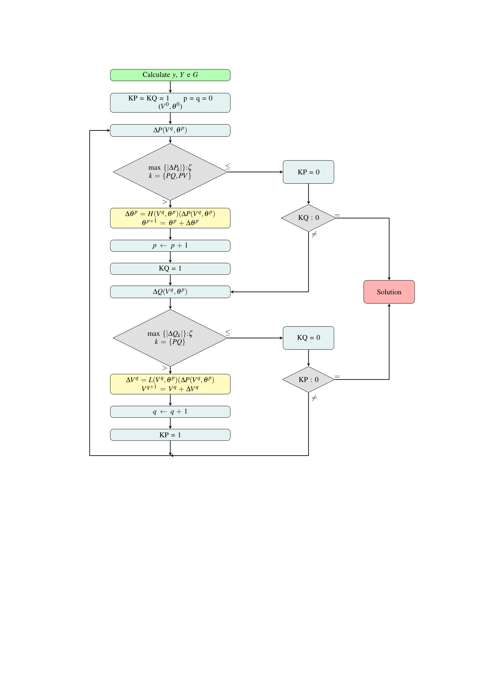

# Application of Newton's methods for solving load flow problems
## Introduction
  This repository was created to facilitate the reproducibility of the article with the same name. You can find the source code, with instructions for its use, versions of the article, and all the structures used until the time of publication. Along with the license taken by the authors.
The files are organized as follow:
* /Data - System files used
* /deliver - 
* /dev - Notes and codes used during this research
* /figures - Figures used for the development of the work

##Software and libraries used

1. Programming Language: [Python 3.3](https://www.python.org/) 

